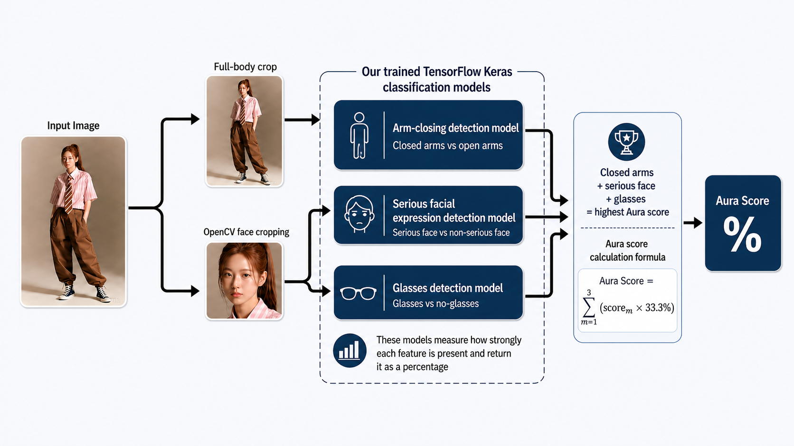
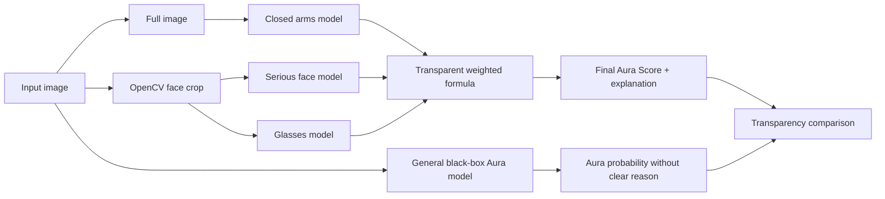
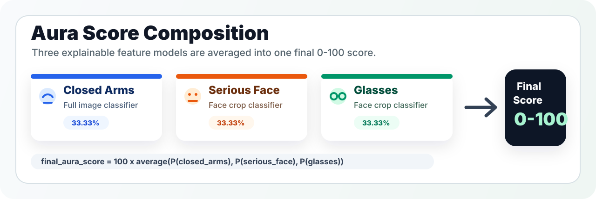
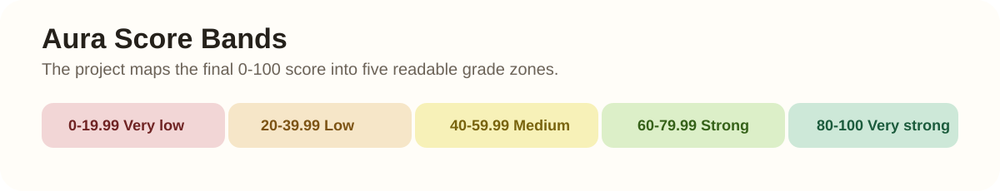

<p align="center">
  
</p>

<h1 align="center">Aura Score Analyzer</h1>

[](https://colab.research.google.com/github/mhirez/Aura-Score-Analyzer/blob/main/aura_score_analyzer_colab.ipynb)




## Live Website

- Website: [AuraAnalyzer.pro](https://auraanalyzer.pro)
- Colab notebook: [Open in Colab](https://colab.research.google.com/github/mhirez/Aura-Score-Analyzer/blob/main/aura_score_analyzer_colab.ipynb)

## Project Docs

- [Model Card](MODEL_CARD.md)
- [Dataset Notes](DATASET.md)
- [Contributing Guide](CONTRIBUTING.md)
- [License](LICENSE)

## At A Glance

| App Surface | What It Does |
| --- | --- |
| Streamlit app | Runs the repository as a web app directly from GitHub-hosted code and model assets. |
| Colab notebook | Gives a guided, step-by-step demo flow for setup, model loading, and testing. |
| Gradio interface | Provides the simple public-facing image upload and analysis experience inside Colab. |

## Overview

**Aura Score Analyzer** is an interactive AI image-analysis project that estimates how strong a person's "aura" appears in a photo.

This project was developed by **Mohammed Hirez** and **Lama Aladdin** at the [University of Limerick](https://www.ul.ie/) as part of the [Bachelor/Master of Science in Artificial Intelligence and Machine Learning](https://www.ul.ie/courses/bachelormaster-science-artificial-intelligence-and-machine-learning) programme and the [CS4242 - Machine Learning for Interactive Systems](https://bookofmodules.ul.ie/Default.aspx?ModuleCodeParameter=%7CCS4242%7C) module.

The project uses two approaches:

1. A **transparent multi-model program** that combines three clear feature detectors.
2. A **general black-box Aura model** that predicts Aura directly but does not explain the reason behind the decision.

This makes the project useful for demonstrating why transparency in AI matters. The transparent score shows exactly which visual features affected the result, while the general model only gives a probability.

## Project Idea

The goal is to create a simple but expressive AI system that gives a playful **Aura Score** based on visual body language and facial cues.

Instead of depending only on one large model, the main scoring system combines three smaller binary TensorFlow/Keras classifiers. Each classifier is responsible for one feature:

1. **Closed or crossed arms**
2. **Serious / non-smiling facial expression**
3. **Wearing glasses**

The more strongly these features appear in the image, the higher the final Aura Score becomes.

The separate general model is included for comparison. It predicts whether the whole image looks like **Aura** or **Not Aura**, but it does not clearly explain why.

## Pipeline Graphic



## How It Works

### 1. Input Image

The user uploads one photo through the Gradio website interface launched from Colab.

### 2. Image Preparation

The image is processed in two different ways:

- A **full image** is used for the arm-position model.
- An **OpenCV face crop** is used for the serious-face and glasses models.

This is important because the arm model needs the body or upper body, while the serious-face and glasses models perform better when the face is centered and cropped.

### 3. Model Predictions

The image is passed through three trained TensorFlow/Keras feature models:

| Model | Input Used | Classes | Target Class for Higher Aura |
| --- | --- | --- | --- |
| Arm-closing detection model | Full image | Closed arms vs open arms | Closed / crossed arms |
| Serious expression detection model | Face crop | Serious face vs not serious face | Serious face |
| Glasses detection model | Face crop | Glasses vs no-glasses | Glasses |

Each model returns a probability score showing how strongly the target feature is present.

### 4. General Model Comparison

The general model also receives the image and returns:

| Model | Input Used | Classes | Target Class |
| --- | --- | --- | --- |
| General Aura model | Full image | Aura vs not aura | Aura |

This result is displayed separately because it is less transparent. It can say an image has Aura, but it does not explain whether that decision came from arms, face, glasses, lighting, pose, or another hidden pattern.

## Aura Score Calculation

Each transparent feature model contributes equally to the final score, keeping the result easy to inspect and explain.



```text
Aura Score = 100 * ((P(closed arms) + P(serious face) + P(glasses)) / 3)
```

Equivalent formula:

```text
closed_arms_score = P(closed arms) * 33.3333
serious_face_score = P(serious face) * 33.3333
glasses_score = P(glasses) * 33.3333

Aura Score = closed_arms_score + serious_face_score + glasses_score
```

Where:

- `P(closed arms)` is the model confidence that the person has closed/crossed arms.
- `P(serious face)` is the model confidence that the person has a serious or non-smiling face.
- `P(glasses)` is the model confidence that the person is wearing glasses.

The final score is shown from **0 to 100**.

## Example Interpretation

If the models return:

```text
P(closed arms)  = 0.80
P(serious face) = 0.70
P(glasses)      = 0.90
```

Then:

```text
Aura Score = 100 * ((0.80 + 0.70 + 0.90) / 3)
Aura Score = 80.00 / 100
```

This would be interpreted as a **Very strong aura**, because all three target features are strongly detected.

## Score Grades



| Aura Score | Grade |
| ---: | --- |
| 80 to 100 | Very strong aura |
| 60 to 79.99 | Strong aura |
| 40 to 59.99 | Medium aura |
| 20 to 39.99 | Low aura |
| 0 to 19.99 | Very low aura |

## Why Face Cropping Matters

The serious-face and glasses models classify facial features. If the full image is passed directly into these models, the face may be too small and the prediction may be less reliable.

To improve this, the system uses **OpenCV Haar Cascade face detection** to crop the face before sending it to the serious-face and glasses models.

This helps the models focus on:

- The mouth and facial expression for the serious-face model
- The eye area and glasses shape for the glasses model

If no face is detected, the program uses the full image as a fallback and explains that fallback in the report.

## Main Features

- Runs inside Google Colab
- Runs as a Streamlit web app from GitHub
- Includes a Gradio website interface
- Downloads project files directly from GitHub
- Uses three separate trained TensorFlow/Keras feature models
- Uses a fourth general Aura model for comparison
- Crops the face using OpenCV before facial analysis
- Uses the full image for arm-position analysis
- Calculates a final Aura Score out of 100
- Prints all class probabilities
- Explains how each feature affected the final score
- Compares the transparent program to the general black-box model
- Saves the result as `/content/aura_result.json`

## Technologies Used

- Python
- TensorFlow / Keras
- `tf_keras` for legacy `.h5` model compatibility
- TensorFlow.js conversion tooling
- OpenCV
- OpenCV Haar Cascade face detection
- NumPy
- Pillow
- Matplotlib
- Gradio
- Streamlit
- Google Colab
- GitHub

## Repository Structure

```text
Aura-Score-Analyzer/
|
+-- README.md
+-- aura_score_analyzer_colab.ipynb
+-- streamlit_app.py
+-- requirements.txt
+-- general_model.zip
|
+-- Feature Detection Models/
|   +-- crossed_open_arms.zip
|   +-- smile_not_smile_model.zip
|   +-- glasses_no_glasses.zip
|
+-- Data/
|   +-- crossed_open_arms/
|   +-- smile_not_smile/
|   +-- glasses_no_glasses/
|
+-- assets/
    +-- aura_pipeline.png
```

## Run as a Streamlit Web App

The repository includes a standalone Streamlit app:

```text
streamlit_app.py
```

This app loads the same model ZIP files from the GitHub repository and lets users test photos directly in a web interface.

### Deploy on Streamlit Community Cloud

1. Go to:

```text
https://share.streamlit.io/
```

2. Sign in with GitHub.
3. Click **New app**.
4. Choose this repository:

```text
mhirez/Aura-Score-Analyzer
```

5. Set the branch to:

```text
main
```

6. Set the main file path to:

```text
streamlit_app.py
```

7. Open **Advanced settings** and set the Python version to:

```text
3.12
```

8. Click **Deploy**.

Streamlit will install packages from `requirements.txt`, load the models, and start the web app. The TensorFlow packages in `requirements.txt` are pinned because TensorFlow does not support every new Python version immediately.

If the app was already created with a different Python version, delete that Streamlit app and deploy it again. Rebooting is not enough because Streamlit's Python version is selected when the app is created. Do not deploy this TensorFlow app with Python 3.14.

### Run Locally

The Streamlit app is easiest to run on Streamlit Community Cloud or Google Colab. Local running is best with Python 3.12 because TensorFlow does not provide wheels for every newer Python version immediately.

```bash
cd "Aura Score Analyzer"
python -m venv .venv
source .venv/bin/activate
pip install -r requirements.txt
streamlit run streamlit_app.py
```

### GitHub Codespaces Troubleshooting

If a Codespaces preview shows an error that mentions `tensorflowjs`, the Codespace is running an older version of the app or has old packages installed.

Run this in the Codespaces terminal:

```bash
git pull
python -m pip uninstall -y tensorflowjs tensorflow-decision-forests tensorflow-hub
python -m pip install --user --upgrade -r requirements.txt
streamlit cache clear
streamlit run streamlit_app.py --server.enableCORS false --server.enableXsrfProtection false
```

If the error is still there, rebuild the Codespace container so it uses the current `.devcontainer/devcontainer.json`.

## How to Use in Google Colab

### 1. Open the Notebook

Use this Colab link:

```text
https://colab.research.google.com/github/mhirez/Aura-Score-Analyzer/blob/main/aura_score_analyzer_colab.ipynb
```

If the repository owner or name is different, update the link and the `GITHUB_REPO_URL` variable in Cell 2.

### 2. Run the Setup Cells

Run these cells once:

```text
Cell 1: Install packages
Cell 2: Download project files from GitHub
Cell 3: Extract model zip files
Cell 4: Define face-cropping display helpers
Cell 5: Define model-loading and scoring helpers
Cell 6: Load the models once
Cell 7: Website-only note; no image upload happens here
```

### 3. Use the App

Use the website interface:

```text
Run Cell 8
Open the public Gradio link
Upload a photo
Click Analyze Aura
```

Cell 7 no longer asks for an image or runs analysis. All testing happens in Cell 8.

## Output Example

```text
AURA SCORE REPORT

Equation:
final_aura_score = 100 * ((P(closed_arms) + P(serious_face) + P(glasses)) / 3)

Model 1: Closed arms
Predicted target probability: 82.15%
Contribution: 27.38 / 100
Reason: The model strongly detected closed arms, so this increased the aura score.

Model 2: Serious face
Predicted target probability: 66.20%
Contribution: 22.07 / 100
Reason: The model detected mostly a serious face, so this moderately increased the aura score.

Model 3: Glasses
Predicted target probability: 91.30%
Contribution: 30.43 / 100
Reason: The model strongly detected glasses, so this increased the aura score.

Transparent program final score:
79.88 / 100

Grade:
Strong aura

General model comparison:
General model Aura probability: 84.50%
Reason: This model gives a direct Aura or not Aura decision, but it does not explain which visual feature caused the decision.
```

## JSON Output

The program also saves a detailed JSON result:

```json
{
  "input_image_path": "/content/aura_gradio_inputs/current_input.jpg",
  "face_crop_path": "/content/face_crop.png",
  "whether_face_crop_was_used": true,
  "transparent_component_models": [
    {
      "key": "closed_arms",
      "target_probability": 0.8215,
      "contribution": 27.38
    },
    {
      "key": "serious_face",
      "target_probability": 0.662,
      "contribution": 22.07
    },
    {
      "key": "glasses",
      "target_probability": 0.913,
      "contribution": 30.43
    }
  ],
  "general_model": {
    "target_probability": 0.845
  },
  "final_aura_score": 79.88,
  "grade": "Strong aura"
}
```

## Model Details

### 1. Arm-Closing Detection Model

**Input:** Full image  
**Classes:** Closed/crossed arms vs open arms  
**Target feature:** Closed or crossed arms  
**Reason:** Closed or crossed arms are treated as a strong body-language signal in the scoring system.

### 2. Serious Facial Expression Detection Model

**Input:** Cropped face  
**Classes:** Serious face vs not serious face  
**Target feature:** Serious face  
**Reason:** A serious facial expression increases the Aura Score.

### 3. Glasses Detection Model

**Input:** Cropped face  
**Classes:** Glasses vs no-glasses  
**Target feature:** Glasses  
**Reason:** Glasses are treated as an additional visual feature that increases the Aura Score.

### 4. General Aura Model

**Input:** Full image  
**Classes:** Aura vs not aura  
**Target feature:** Aura  
**Reason:** This model is useful as a comparison, but it is less transparent because it does not explain which feature caused the prediction.

## Why Three Separate Models?

Using three separate models makes the system more explainable.

Instead of only giving one final number, the program can show exactly how the score was created:

- How much came from arm position
- How much came from serious facial expression
- How much came from glasses detection

This makes the project more transparent and easier to present than a single black-box model.

## Transparency Lesson

The general model may produce a useful Aura probability, but it does not clearly answer the most important question:

```text
Why did the model make this decision?
```

The transparent program answers that question by showing the exact contribution from each feature.

This is the main AI lesson of the project: **a prediction is more useful when people can understand the reason behind it.**

## Limitations

This project is experimental and playful. The Aura Score is not a real psychological or scientific measurement.

The result depends on:

- The quality of the training data
- Lighting conditions
- Camera angle
- Face detection accuracy
- Whether the person's arms and face are clearly visible
- How similar the input image is to the training examples

The score should be understood as an interactive AI output, not an objective judgment about a person.

## Future Improvements

Possible future improvements include:

- Training on a larger and more diverse dataset
- Improving face detection using MediaPipe or RetinaFace
- Adding confidence thresholds
- Showing visual overlays on the detected face crop
- Supporting multiple people in one image
- Allowing different weights for each model
- Adding more aura-related visual features
- Deploying a permanent web app outside Colab

## Project Summary

Aura Score Analyzer is a multi-model TensorFlow/Keras image-classification project that combines body-language and facial-feature detection into one final interactive score.

The transparent system uses:

- A full-image model for arm position
- A cropped-face model for serious expression
- A cropped-face model for glasses detection

These predictions are combined into a clear score with a detailed explanation. The general Aura model is included to compare transparent AI with black-box AI.

## Image Credit / Project Diagram

The diagram at the top of this README shows the full project workflow:

```text
Input image -> Full image -> Arm model
            -> Face crop  -> Serious face model
                         -> Glasses model
            -> Weighted formula -> Aura Score
            -> General model -> Black-box Aura probability
```

The diagram file is stored at:

```text
assets/aura_pipeline.png
```

## Contributing

Contributions are welcome. Start with [CONTRIBUTING.md](CONTRIBUTING.md) for setup, expectations, and pull-request guidance.

## License

The repository code is available under the [MIT License](LICENSE). Dataset files and model artifacts may have separate provenance or usage considerations, so check [DATASET.md](DATASET.md) and [MODEL_CARD.md](MODEL_CARD.md) before redistributing those assets.
